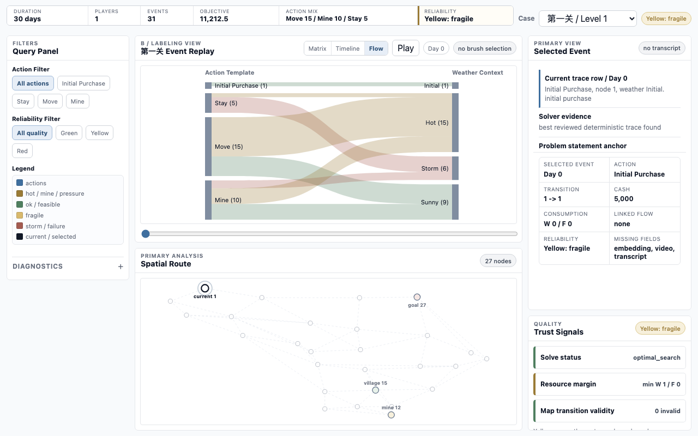
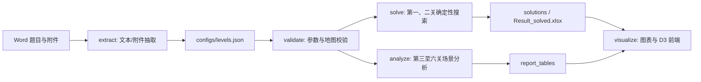
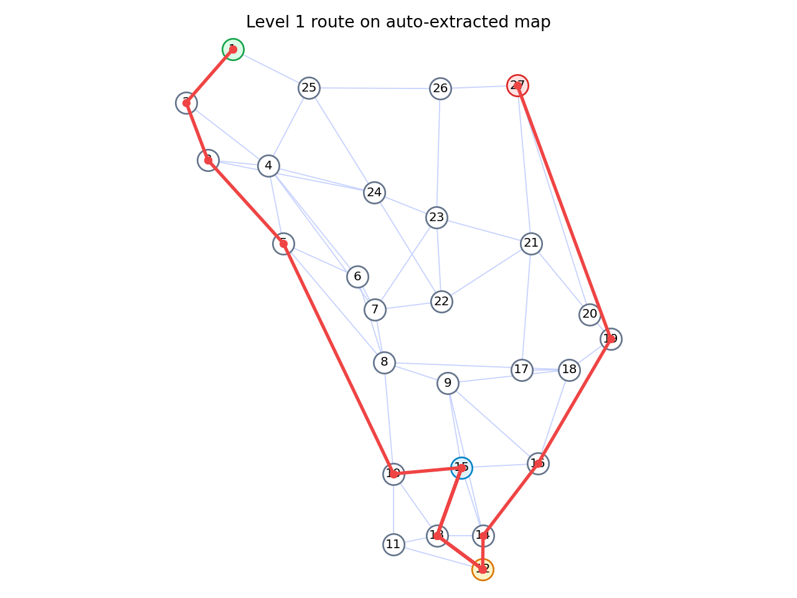
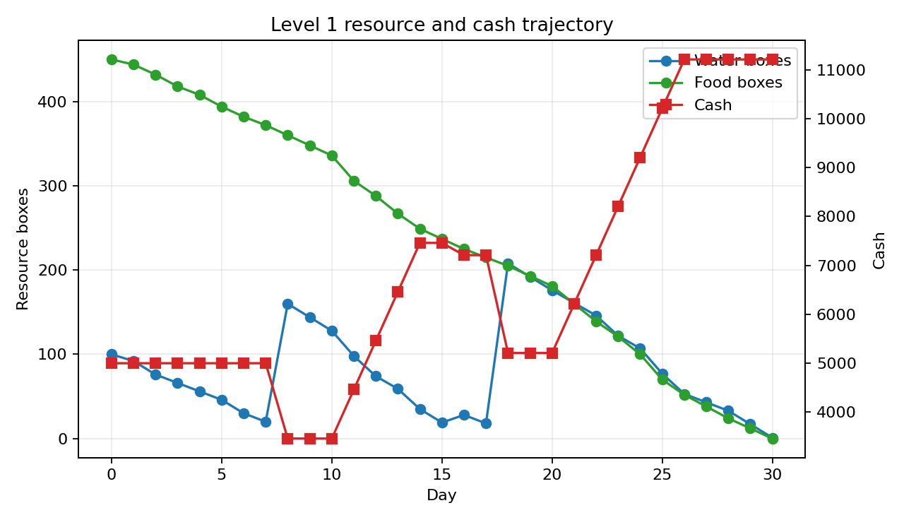
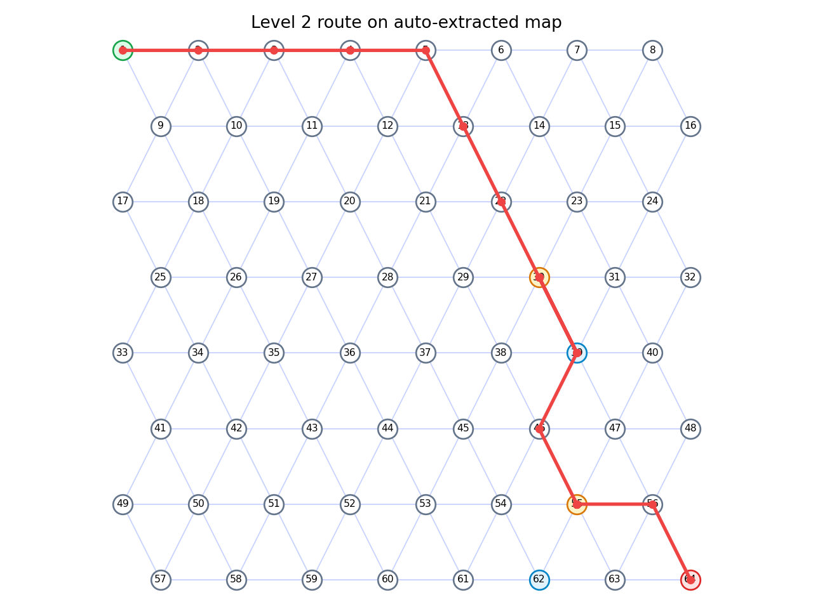
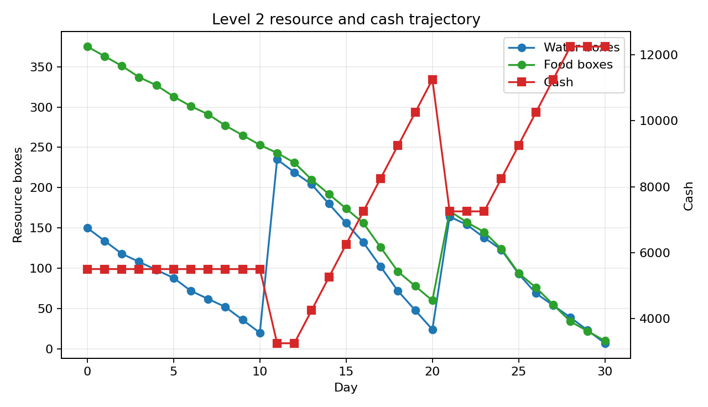

# Desert Crossing Policy Analysis

[English Version](README_EN.md)

> 2020 年高教社杯全国大学生数学建模竞赛 B 题“穿越沙漠”的可复现实验项目。项目把题目 Word 材料、附件参数、最优路径搜索、未知天气场景分析、多玩家策略讨论和 D3.js 可视分析前端整合为一套可以本地运行、可以截图写论文、也可以上传 GitHub 展示的建模系统。



## 项目亮点

- **完整题目链路**：从 `2020B-穿越沙漠.docx` 和 `附件.docx` 中抽取题目文本、附件结构和表格摘要。
- **配置化建模**：六关地图、天气、资源、起终点、矿山、村庄和多人规则统一写入 `configs/levels.json`。
- **可复现求解**：第一、二关使用动态规划/状态搜索生成可行最优轨迹，并输出 `Result_solved.xlsx`。
- **稳健策略分析**：第三、四关针对未知天气生成场景分析，第五、六关给出多人合作策略与失败原因。
- **论文风格前端**：使用静态 `D3.js` 构建单页可视分析 demo，包含事件回放、步骤流程、空间路径、资源状态和可靠性说明。
- **适合展示**：输出图片、CSV/JSON 轨迹、Markdown 摘要和可离线部署的前端页面，便于答辩、论文插图和 GitHub Pages 展示。

## 题目背景

“穿越沙漠”是一个资源约束下的路径决策问题。玩家从起点出发，在有限天数内穿越地图到达终点。每天会遇到晴朗、高温或沙暴天气，不同天气会影响水和食物消耗。玩家可以移动、停留、挖矿、在村庄补给，并在到达终点时保留尽可能多的资金。

本项目将问题拆成三类建模任务：

| 任务 | 对应关卡 | 目标 |
| --- | --- | --- |
| 已知天气单人最优策略 | 第一关、第二关 | 求最大剩余资金，并填写 `Result.xlsx` |
| 未知天气滚动策略 | 第三关、第四关 | 生成多场景稳健策略和失败率分析 |
| 多玩家合作/博弈策略 | 第五关、第六关 | 分析多人同行、同矿、同村补给规则下的可行性 |

## 方法概览



核心思想是把“每天的节点、天气、行动、水、食物、现金”表示为状态序列，在合法动作约束下搜索最优或稳健策略。对未知天气关卡，项目生成场景表并比较策略的失败率、最优收益、最差收益和滚动策略结果。

## 快速开始

项目主要使用 Python 标准库运行。若需要写入 Excel 结果文件，需要安装 `openpyxl`。

```bash
pip install openpyxl
```

推荐使用当前建模环境运行：

```bash
/opt/miniconda3/envs/pytorch_env/bin/python run_desert_model.py extract
/opt/miniconda3/envs/pytorch_env/bin/python run_desert_model.py validate --levels all
/opt/miniconda3/envs/pytorch_env/bin/python run_desert_model.py solve --levels 1,2
/opt/miniconda3/envs/pytorch_env/bin/python run_desert_model.py analyze --levels 3,4,5,6
/opt/miniconda3/envs/pytorch_env/bin/python run_desert_model.py visualize
```

如果你的本地 Python 环境已经配置好，也可以直接使用：

```bash
python run_desert_model.py validate --levels all
python run_desert_model.py solve --levels 1,2
python run_desert_model.py analyze --levels 3,4,5,6
python run_desert_model.py visualize
```

## 可视化前端

生成前端后，不建议直接双击模板文件打开，因为浏览器会限制 `file://` 页面加载本地 `dashboard-data.js`。请使用本地 HTTP 服务：

```bash
python -m http.server 8765 --bind 127.0.0.1 --directory output/frontend
```

然后访问：

```text
http://127.0.0.1:8765/
```

前端是一个单页 D3.js 可视分析界面，适合论文系统图和答辩演示：

- 顶部：关卡选择、全局状态、紧凑 KPI。
- 主视图：事件回放矩阵、步骤流程切换、空间路径主图。
- 右侧：当前事件、资源证据、可靠性信号。
- 输出：`output/frontend/index.html`、`dashboard-data.js`、`app.js`、`charts.js`、`styles.css`。

## 当前结果摘要

| 关卡 | 状态 | 目标值/结论 | 说明 |
| --- | --- | ---: | --- |
| 第一关 | 可行 | 11212.5 | 已生成确定性最优轨迹 |
| 第二关 | 可行 | 12317.5 | 已生成确定性最优轨迹 |
| 第三关 | 可行 | 9670.0 | 40 个场景全部可行，失败率 0% |
| 第四关 | 可行 | 9120.0 | 40 个场景全部可行，失败率 0% |
| 第五关 | 合作策略不可行 | 单人参考 9392.5 | 双人合作在第 3 天出现资源耗尽 |
| 第六关 | 合作策略不可行 | 单人参考 9120.0 | 采样场景下多人合作失败率 100% |

## 输出文件

| 路径 | 内容 |
| --- | --- |
| `output/extracted/` | Word 题目与附件的文本、表格和对象摘要 |
| `output/solutions/` | 第一、二关轨迹 JSON/CSV |
| `output/result/Result_solved.xlsx` | 可提交的第一、二关结果表 |
| `output/report_tables/` | 第三至六关分析摘要和场景表 |
| `output/figures/` | 路径图和资源变化图 |
| `output/frontend/` | 可静态部署的 D3.js 前端 |
| `output/logs/solve_status.json` | 求解状态、目标值和终止状态 |

## 结果图示

| 路径策略 | 资源变化 |
| --- | --- |
|  |  |
|  |  |

## 项目结构

```text
.
├── 2020B-穿越沙漠.docx
├── 附件.docx
├── Result.xlsx
├── configs/
│   └── levels.json
├── desert_model/
│   ├── cli.py
│   ├── config.py
│   ├── extract.py
│   ├── solver.py
│   ├── analyze.py
│   ├── multiplayer.py
│   ├── visualize.py
│   └── frontend_templates/
├── output/
│   ├── extracted/
│   ├── solutions/
│   ├── report_tables/
│   ├── figures/
│   ├── result/
│   └── frontend/
├── tests/
│   └── test_desert_model.py
└── run_desert_model.py
```

## 测试

运行单元测试：

```bash
python -m unittest discover -s tests
```

测试覆盖内容包括：

- 六关配置加载与参数校验。
- 地图邻接表对称性和连通性。
- 天气、起点、终点、矿山、村庄参数复核。
- 资源消耗、负重限制、沙暴移动约束和挖矿规则。
- 确定性求解器与多人策略摘要。

## GitHub 展示建议

上传仓库时建议保留：

- `README.md`：中文说明。
- `README_EN.md`：英文说明。
- `docs/assets/dashboard-preview.png`：首页预览图。
- `output/frontend/`：可部署的静态前端。
- `output/figures/`：论文或答辩可直接引用的图片。

不建议把临时缓存、系统文件和无关大文件上传到 GitHub，例如 `.DS_Store`、虚拟环境目录、编辑器缓存等。

## 说明

本项目用于数学建模学习、复现实验和可视化展示。题目与附件来源于 2020 年高教社杯全国大学生数学建模竞赛 B 题。本仓库不替代正式论文写作，但可以作为模型验证、结果生成、图表制作和答辩演示的工程支撑。
