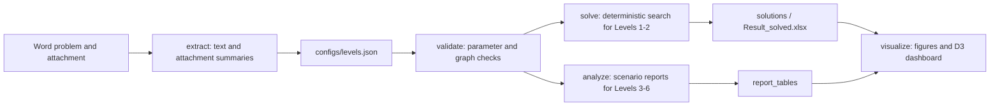

# Desert Crossing Policy Analysis

[中文版](README.md)

> A reproducible modeling and visual analytics project for Problem B, "Desert Crossing", from the 2020 China Undergraduate Mathematical Contest in Modeling. The repository connects Word-based problem materials, reviewed level configurations, deterministic path search, uncertain-weather scenario analysis, multiplayer strategy checks, and a static D3.js visual analytics dashboard.


## Highlights

- **End-to-end problem workflow**: extracts problem text and attachment summaries from `2020B-穿越沙漠.docx` and `附件.docx`.
- **Configuration-driven modeling**: all six levels are described in `configs/levels.json`, including maps, weather, resources, start/goal nodes, mines, villages, and multiplayer rules.
- **Reproducible optimization**: Levels 1 and 2 are solved with deterministic state search and exported to `Result_solved.xlsx`.
- **Robust scenario analysis**: Levels 3 and 4 are evaluated under uncertain weather scenarios; Levels 5 and 6 include multiplayer feasibility and failure analysis.
- **Paper-style dashboard**: a static D3.js single-page interface shows event replay, decision flow, spatial route, resource status, and reliability evidence.
- **Presentation-ready outputs**: figures, CSV/JSON traces, Markdown summaries, and static frontend assets can be used in reports, defenses, or GitHub Pages.

## Problem Background

"Desert Crossing" is a resource-constrained route planning problem. A player starts from a source node, purchases water and food with an initial budget, and must reach the destination before a deadline. Each day has one of three weather conditions: sunny, hot, or storm. Weather affects resource consumption. The player may move, stay, mine for income, or buy supplies in villages, and the final objective is to maximize remaining capital at the destination.

This project covers three modeling settings:

| Task | Levels | Goal |
| --- | --- | --- |
| Single-player optimization with known weather | Levels 1 and 2 | Maximize final capital and fill `Result.xlsx` |
| Rolling strategy under unknown weather | Levels 3 and 4 | Compare robust scenario strategies and failure rates |
| Multiplayer cooperation/game analysis | Levels 5 and 6 | Evaluate feasibility under shared movement, mining, and village-purchase rules |

## Method Overview



The model represents each day as a state sequence containing node, weather, action, water, food, and cash. Legal actions are searched under resource, map, weather, and purchase constraints. For unknown-weather levels, sampled scenarios are compared by feasibility, failure rate, best objective, worst objective, and rolling strategy behavior.

## Quick Start

The project mostly uses the Python standard library. To write the Excel result workbook, install `openpyxl`:

```bash
pip install openpyxl
```

Recommended local environment:

```bash
/opt/miniconda3/envs/pytorch_env/bin/python run_desert_model.py extract
/opt/miniconda3/envs/pytorch_env/bin/python run_desert_model.py validate --levels all
/opt/miniconda3/envs/pytorch_env/bin/python run_desert_model.py solve --levels 1,2
/opt/miniconda3/envs/pytorch_env/bin/python run_desert_model.py analyze --levels 3,4,5,6
/opt/miniconda3/envs/pytorch_env/bin/python run_desert_model.py visualize
```

If your own Python environment is ready:

```bash
python run_desert_model.py validate --levels all
python run_desert_model.py solve --levels 1,2
python run_desert_model.py analyze --levels 3,4,5,6
python run_desert_model.py visualize
```

## D3 Dashboard

After generating the frontend, serve `output/frontend` with a local HTTP server. Opening the template directly through `file://` may block `dashboard-data.js`.

```bash
python -m http.server 8765 --bind 127.0.0.1 --directory output/frontend
```

Then open:

```text
http://127.0.0.1:8765/
```

The dashboard is a single-page D3.js visual analytics demo:

- Top strip: level selector, global status, and compact KPIs.
- Main view: event replay matrix, decision-flow toggle, and spatial route.
- Right panel: selected event, evidence, resource status, and reliability signals.
- Generated assets: `output/frontend/index.html`, `dashboard-data.js`, `app.js`, `charts.js`, and `styles.css`.

## Current Results

| Level | Status | Objective / conclusion | Notes |
| --- | --- | ---: | --- |
| Level 1 | Feasible | 11212.5 | Deterministic optimal trace generated |
| Level 2 | Feasible | 12317.5 | Deterministic optimal trace generated |
| Level 3 | Feasible | 9670.0 | 40 scenarios feasible, 0% failure rate |
| Level 4 | Feasible | 9120.0 | 40 scenarios feasible, 0% failure rate |
| Level 5 | Cooperative strategy infeasible | Single-player reference 9392.5 | Two-player cooperation runs out of resources on day 3 |
| Level 6 | Cooperative strategy infeasible | Single-player reference 9120.0 | 100% failure rate in sampled multiplayer scenarios |

## Outputs

| Path | Description |
| --- | --- |
| `output/extracted/` | Extracted Word text, attachment summaries, and object summaries |
| `output/solutions/` | JSON/CSV traces for Levels 1 and 2 |
| `output/result/Result_solved.xlsx` | Filled result workbook for Levels 1 and 2 |
| `output/report_tables/` | Scenario reports and analysis summaries for Levels 3-6 |
| `output/figures/` | Route and resource figures |
| `output/frontend/` | Static D3.js dashboard |
| `output/logs/solve_status.json` | Solve status, objective values, and final states |

## Figures

| Route | Resources |
| --- | --- |
|  |  |
|  |  |

## Repository Structure

```text
.
├── 2020B-穿越沙漠.docx
├── 附件.docx
├── Result.xlsx
├── configs/
│   └── levels.json
├── desert_model/
│   ├── cli.py
│   ├── config.py
│   ├── extract.py
│   ├── solver.py
│   ├── analyze.py
│   ├── multiplayer.py
│   ├── visualize.py
│   └── frontend_templates/
├── output/
│   ├── extracted/
│   ├── solutions/
│   ├── report_tables/
│   ├── figures/
│   ├── result/
│   └── frontend/
├── tests/
│   └── test_desert_model.py
└── run_desert_model.py
```

## Tests

```bash
python -m unittest discover -s tests
```

The tests cover:

- loading and validating all six level configurations;
- graph symmetry and reachability checks;
- weather, start/goal, mine, and village parameter checks;
- resource consumption, carrying capacity, storm movement, and mining constraints;
- deterministic solver behavior and multiplayer strategy summaries.

## GitHub Publishing Notes

Recommended files to keep in the repository:

- `README.md`: Chinese project description.
- `README_EN.md`: English project description.
- `docs/assets/dashboard-preview.png`: README preview image.
- `output/frontend/`: static dashboard assets.
- `output/figures/`: report-ready figures.

Avoid uploading temporary caches, system files, virtual environments, and unrelated large files, such as `.DS_Store`, editor caches, or local environment directories.

## Note

This repository is intended for mathematical modeling study, reproducible experiments, and visual presentation. The original problem statement belongs to the 2020 China Undergraduate Mathematical Contest in Modeling. This project does not replace a formal modeling paper, but it provides engineering support for model validation, result generation, figure production, and defense demonstrations.
